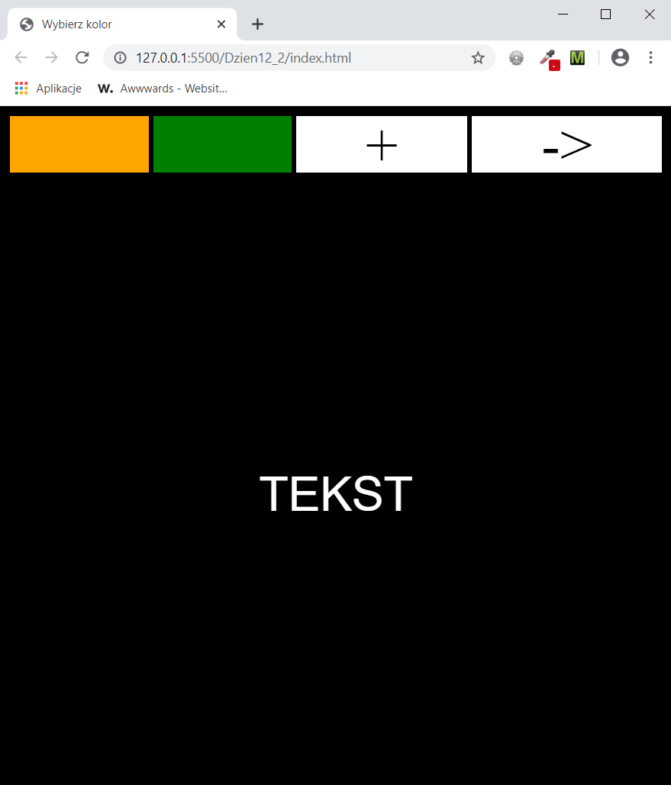
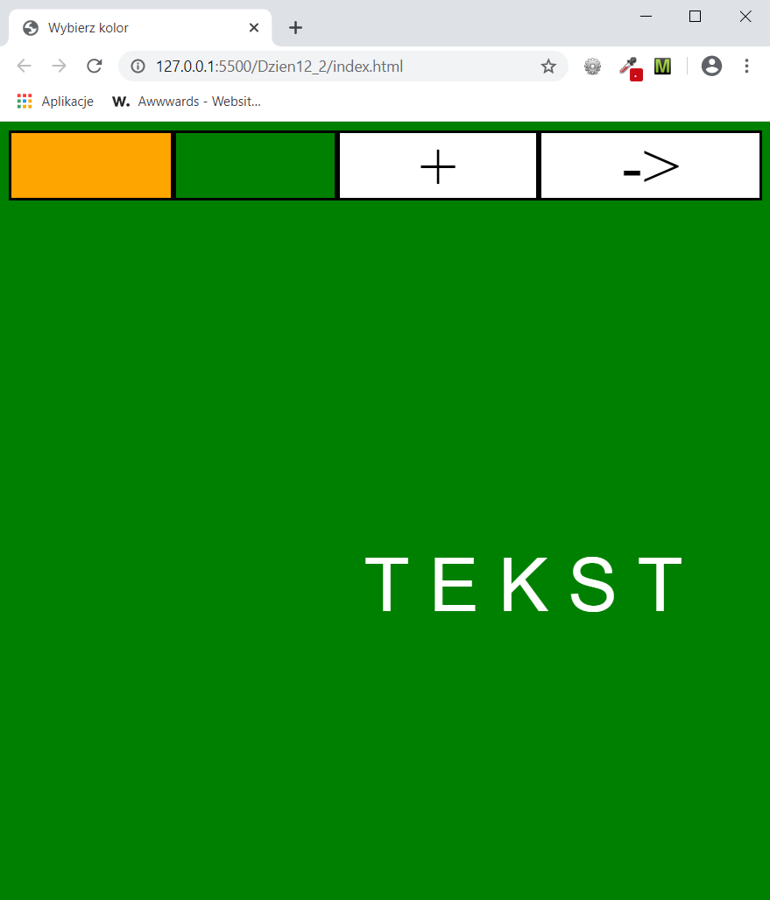

<h3>Cel ćwiczenia:</h3>

Z użyciem jQuery sprawić, by po kliknięciu odpowiedniego znacznika DIV wykonała się określona akcja. Zmiana koloru na zielony lub pomarańczowy, powiększenie tekstu lub jego przesunięcie w prawo z jednoczesnym zwiększeniem przerw między literami.

