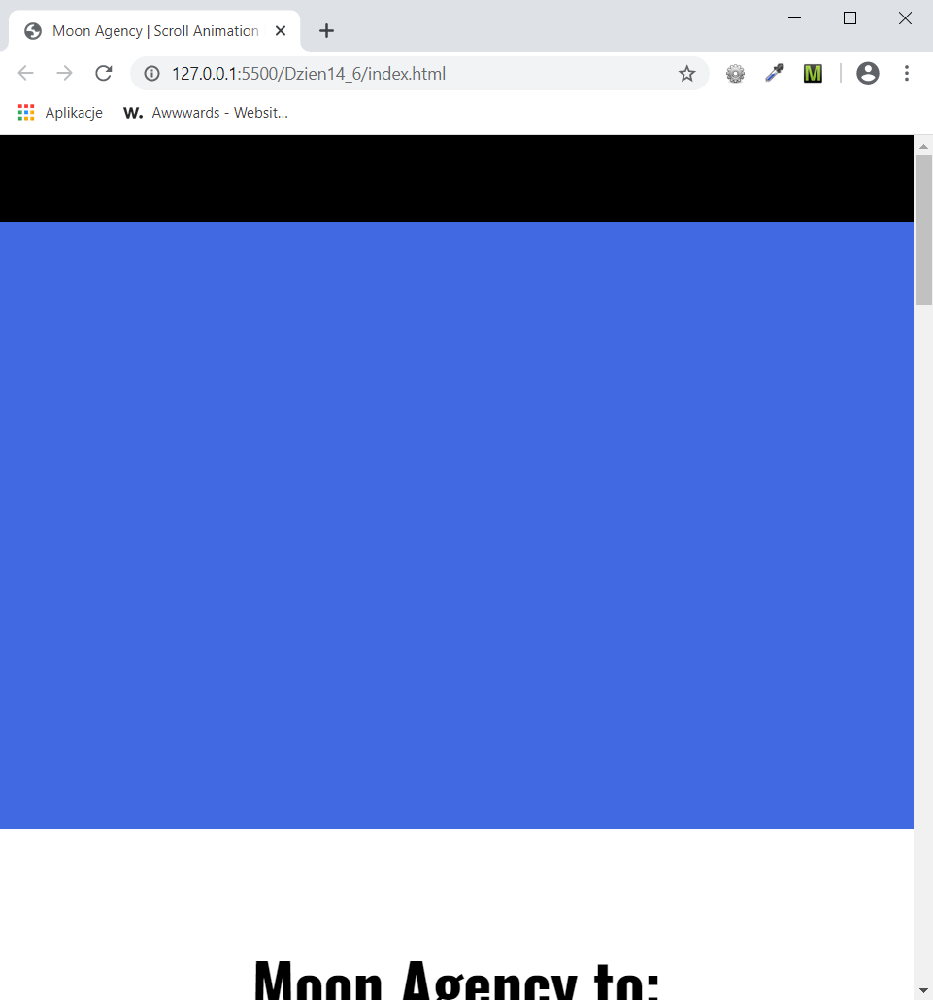

<h3>Cel ćwiczenia:</h3>

Stworzyć animację pojawiania się elementów na stronie przy skrolowaniu w JQ. Pierwszy element jest widoczny, kolejne wjeżdżają na przemian od lewej lub prawej, dwa ostatnie "rosną" na stronie.

