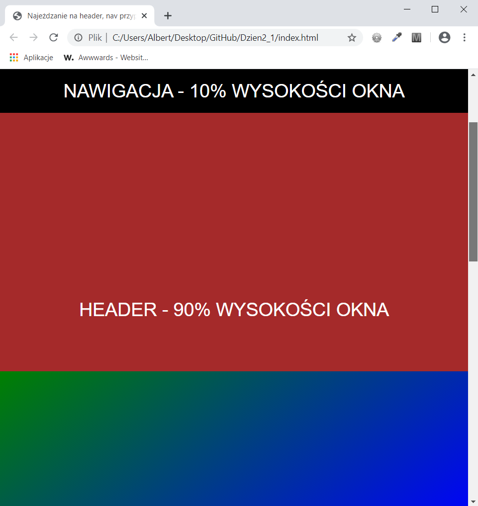

<h3>Cel ćwiczenia:</h3>

Przy użyciu właściwości position "przykleić" nawigację do okna przeglądarki.
Podczas scrollowania header i main nawigacja zawsze jest widoczna dla użytkownika w
górnej części strony 

