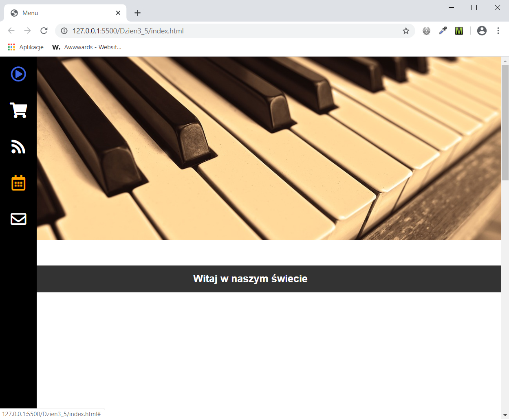

<h3>Cel ćwiczenia:</h3>

Stworzyć dwa menu, które wyświetlają się zamiennie w zależności od szerokości okna przeglądarki przy pomocy media queries oraz zaimportować font ikony. Przy pomocy pseudo klasy :hover zmienić kolor ikon po najechaniu.

