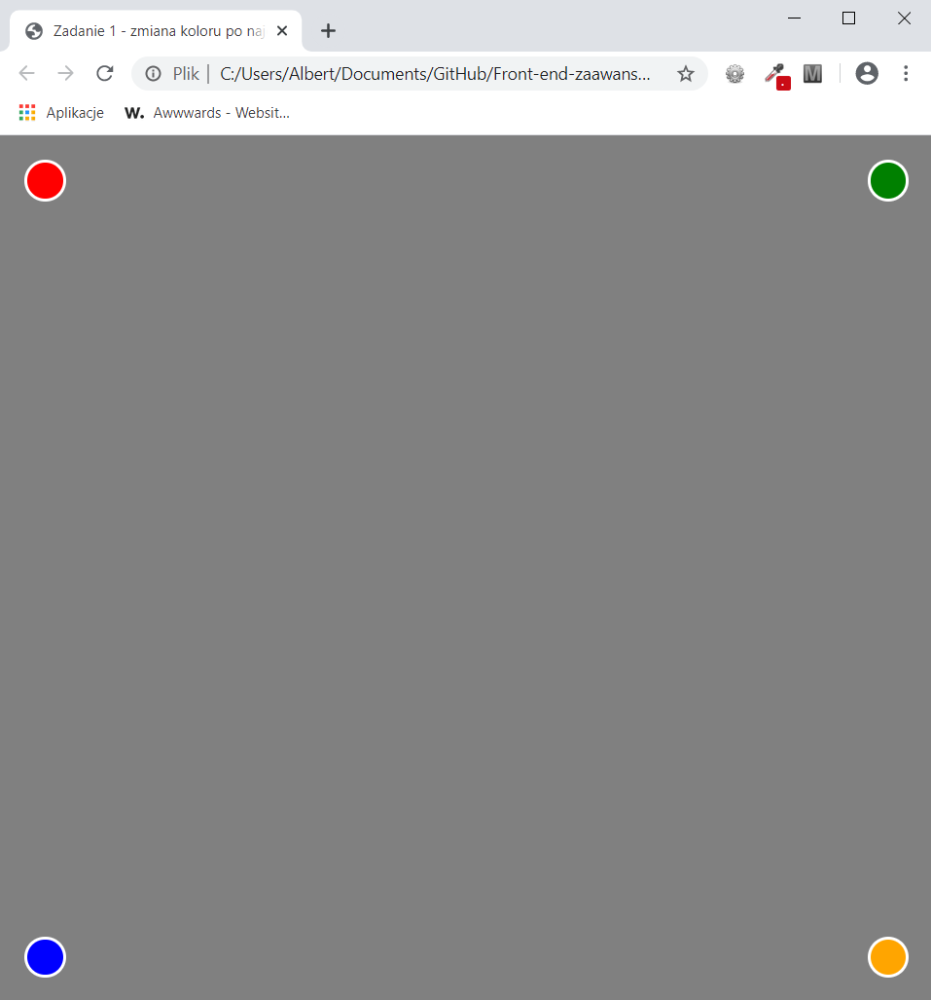
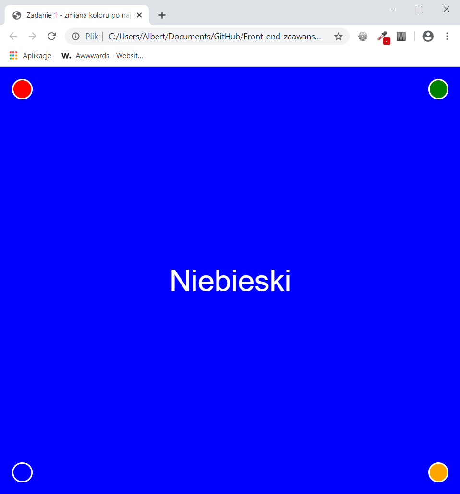

<h3>Cel ćwiczenia:</h3>

Stworzyć cztery kolorowe kółka, po najechaniu na jedno z nich kolor tła ma się zmieniać z opóźnieniem przy pomocy transition oraz ma zostać wyświetlona na środku nazwa koloru.

