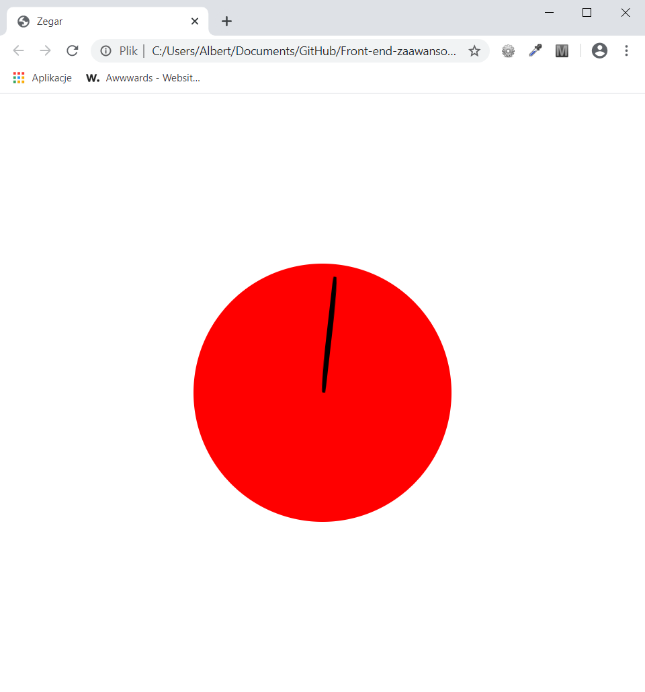

<h3>Cel ćwiczenia:</h3>

Stworzyć animację zegara, po najechaniu na wskazówkę zaczyna ona co sekundę "tykać" (transition: 60s steps(60);). Po zabraniu kursora wraca na swoje miejsce w takim samym czasie.

