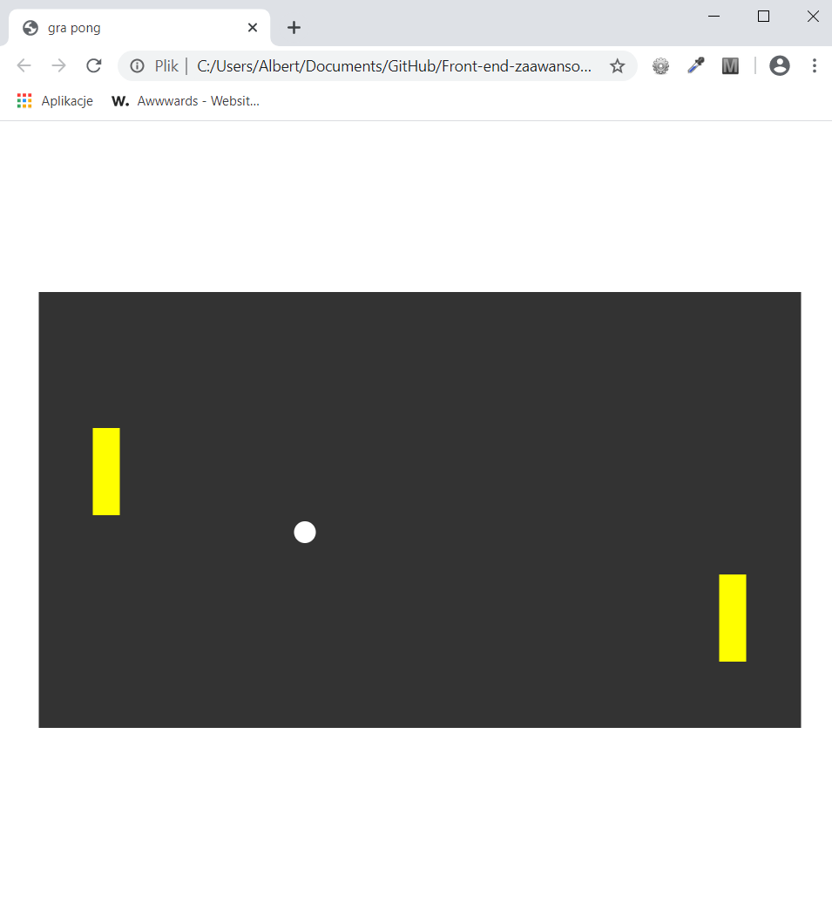
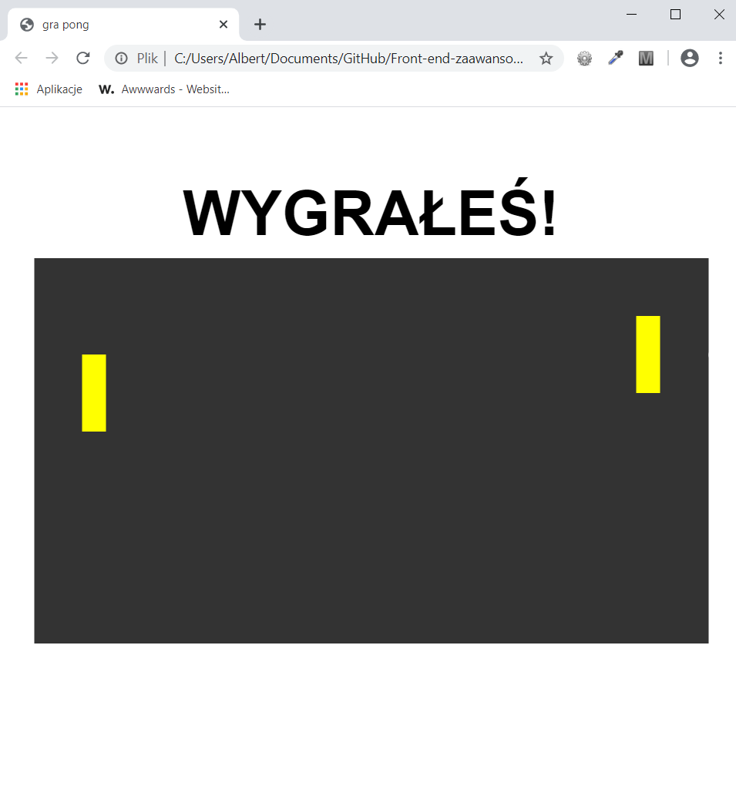

<h3>Cel ćwiczenia:</h3>

Wykorzystując zmienne stworzyć animację gry pong, animacja powinna być w miarę płynna. Animacja wyświetla się tylko raz, na końcu pojawia się napis "wygrałeś" z jednosekundowym opóźnieniem.

